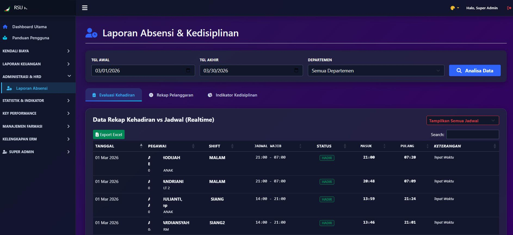
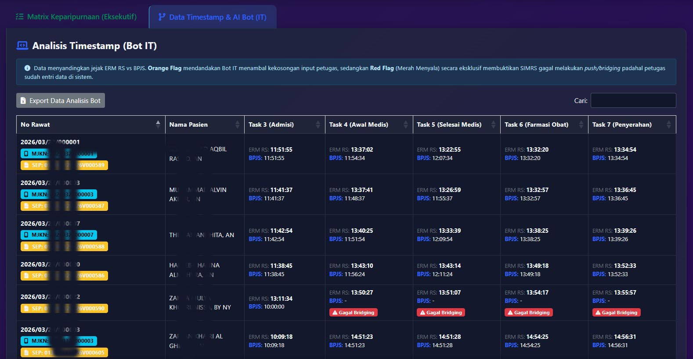
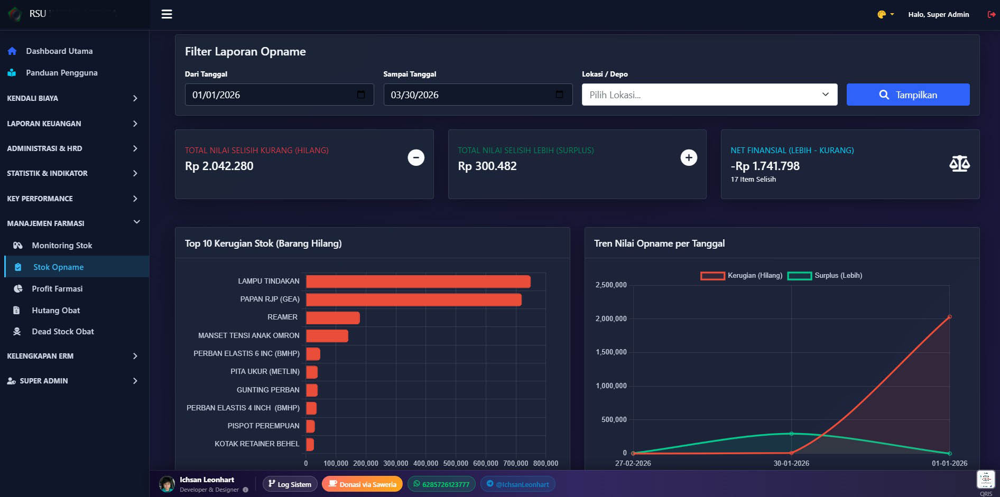

# 📘 Buku Sakti Pengguna: Dashboard Eksekutif v3.6.0+
*Panduan canggih buat bos-bos, manajemen, sampe tim IT yang mau tau rahasia dapur keuangan RS.*

---

## 🚀 1. Persiapan Masuk (Login & Keamanan)

Halo! Sebelum masuk ke dunia grafik yang warna-warni, pastiin dulu kamu punya akses ya. Dashboard ini udah kami suntik proteksi **Zero-Trust**. 

*   **Username & Password**: Pake akun SIMKES Khanza kamu.
*   **Role & Jabatan**: Gak semua orang bisa intip menu "piutang" atau "pihak ketiga". Cuma kamu yang dapet mandat Role **'Admin'** atau **'Manajemen'** yang bisa masuk. 
*   **Keamanan Ekstra**: Kalo salah password 6 kali, kamu bakal kena *lockout* (dikunci) selama 60 detik. Jadi, jangan asal tebak ya!

---

## 🧭 2. Menjelajahi Menu (Sidebar Masterclass)

Kita udah pecah menu-menu ini jadi kategori biar gak pusing carinya:

---

## 💼 3. Kendali Biaya (Biaya Riil vs Billing)

*   **Billing Ralan**: Di sini kamu bisa liat berapa sih tagihan pasien yang lagi jalan di rawat jalan. Penting buat kontrol kasir.
*   **Billing Ranap**: Pantau biaya pasien yang opname secara *realtime*. Gak perlu nunggu pasien pulang buat tau billingnya udah bengkak apa belum. 

*   *Tips: Klik "Nota" hijau buat liat detail item per item. Audit jadi gampang kan?*

---

## 💰 4. Laporan Keuangan (Ujung Tombak Omzet)

*   **Laporan Kas**: Rekapitulasi uang yang bener-bener ada di tangan (tunai).

*   **Detail Billing**: Kalo pengen liat rincian billing global secara brutal (semua item tindakan keluar di sini).
*   **Laporan Piutang**: Menu favorit Direktur! Di sini keliatan semua **"Uang Kita di Luar"**. Berapa klaim asuransi yang belum cair atau bon pasien yang belum lunas.

*   **Laporan Tunai**: Rekapitulasi pemasukan kasir harian per shift. Cocok buat cocokin setoran.
*   **Analisa Tindakan**: Mau tau dokter siapa yang paling rajin kasih tindakan? Cek di sini.

*   **Analisa Lengkap**: Bedah tuntas pemasukan per unit kerja. 
*   **Jasa Medis**: Khusus buat monitor hak-hak dokter dan perawat dari setiap tindakan.

---

## 📅 5. Administrasi & HRD (Monitoring Pegawai)

*   **Laporan Absensi**: Pantau siapa yang rajin, siapa yang hobinya mepet jam masuk, sampe siapa yang sering mangkir. 

---

## 📊 6. Statistik & Indikator (Data Akreditasi)

*   **Kunjungan RS**: Grafik seberapa populer RS kamu di mata warga.

*   **BOR LOS TOI**: Angka keramat buat rawat inap. Seberapa efisien bed (tempat tidur) kita dipake?

*   **Laporan Penyakit**: 10 besar penyakit paling trendi di RS. Berguna buat stok obat!

*   **Waktu Tunggu (TAT)**: Seberapa lama pasien nunggu dari daftar sampe dilayani. Jangan kelamaan ya, nanti pasiennya curhat di Google Maps.
.jpg)

*   **Demografi Pasien**: Pasien kita asalnya dari mana sih? Umurnya berapa?

*   **Kepatuhan Satu Sehat**: Reportase apakah data rekam medis kita nyampe ke server Kemenkes apa nyangkut di jalan.

*   **Antrean Online BPJS**: Monitoring *Task ID* (T3 sampe T7). Kalo ada yang merah ("Bocor"), buruan cek IT-nya ya!

---

## 🏆 7. Key Performance (KPI & Kinerja)

*   **Kinerja Dokter**: Papan klasemen produktivitas dokter.

*   **Laporan Operasi**: Rekapitulasi tindakan bedah. Dari yang kecil sampe operasi besar.

---

## 💊 8. Manajemen Farmasi (Gudang Cuan)

*   **Monitoring Stok**: Biar gak kejadian "Obat Kosong" padahal pasien butuh banget.

*   **Stok Opname**: Buat audit stok fisik vs data sistem.

*   **Profit Farmasi**: Berapa sih margin untung kita dari jualan obat? Semuanya transparan di sini.

*   **Hutang Obat**: Biar kita gak lupa bayar ke PBF/Supplier ya, biar pengiriman lancar terus.

*   **Dead Stock Obat**: Obat-obat yang "tidur" dan gak laku-laku. Buruan tawarin ke dokter sebelum kadaluarsa!

---

## 📝 9. Kelengkapan ERM (Audit Mutu)

*   **Audit Kepatuhan ERM**: Ini menu "Sakti". Sistem bakal nge-scan ribuan berkas rekam medis dan kasih rating. Mana dokter yang rajin isi asesmen, mana yang cuma isi nama doang.

---

## 🎨 10. Fitur Premium Dashboard

Aplikasi ini gak cuma pinter, tapi juga ganteng!
*   **Sistem Tema**: Kamu bisa ganti suasana hati di pojok kanan atas.
*   **Mode Glass**: Mode futuristik tembus pandang (paling canggih!).
*   **Grafik Interaktif**: Klik legenda di grafik buat filter data secara visual.

---

## 🛠️ 11. Pojok IT (Onboarding)

Buat bang admin IT yang baru pasang:
1.  **Aktivasi Database**: Kalo pas login muncul tulisan "Setup Database", jangan panik. Klik aja tombol instalasinya.
2.  **Monetisasi**: Klik nama developer di bawah buat kirim donasi kopi atau kirim "Curhat" berupa *request fitu* khusus via WA/Telegram.

---

*Tertanda,*
*Ichsan Leonhart (Developer & Teman Curhat Sistem)*

> *"Data itu kayak perasaan, kalo gak dirawat bisa ilang pelan-pelan."*
